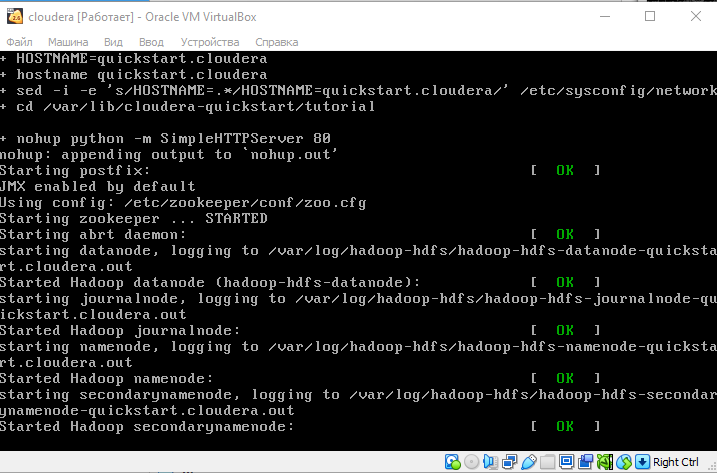
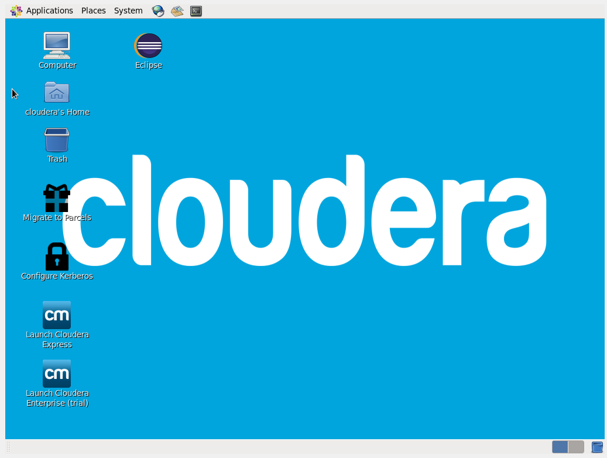

1. Установили VirtualBox и запустили ВМ Cloudera


2. Копирование файлов

3. Вывод информации о файлах в директории
```
    ls -lah
```
4. Перенос файлов на HDFS:
```
    hdfs dfs -copyFromLocal vim-t* /user/cloudera/
```
5. Объединение всех томов в один файл:
```
    hdfs dfs -cat /user/cloudera/vim-t*.fb2 | hdfs dfs -put - /user/cloudera/vim_all.fb2
```
6. Изменение прав доступа к файлу:
```
    hdfs dfs -chmod 755 /user/cloudera/vim_all.fb2
```
7. Вывод информации о размере файлов:
```
    hdfs dfs -du -h /user/cloudera/
```
8. Изменение фактора репликации для файла:
```
    hdfs dfs -setrep -w 2 /user/cloudera/vim_all.fb2
```
9. Вывод информации о размере файлов повторно:
```
    hdfs dfs -du -h /user/cloudera/
```
9. Подсчет количества строк в файле: 
```
    hdfs dfs -cat /user/cloudera/vim.fb2 | wc -l
```