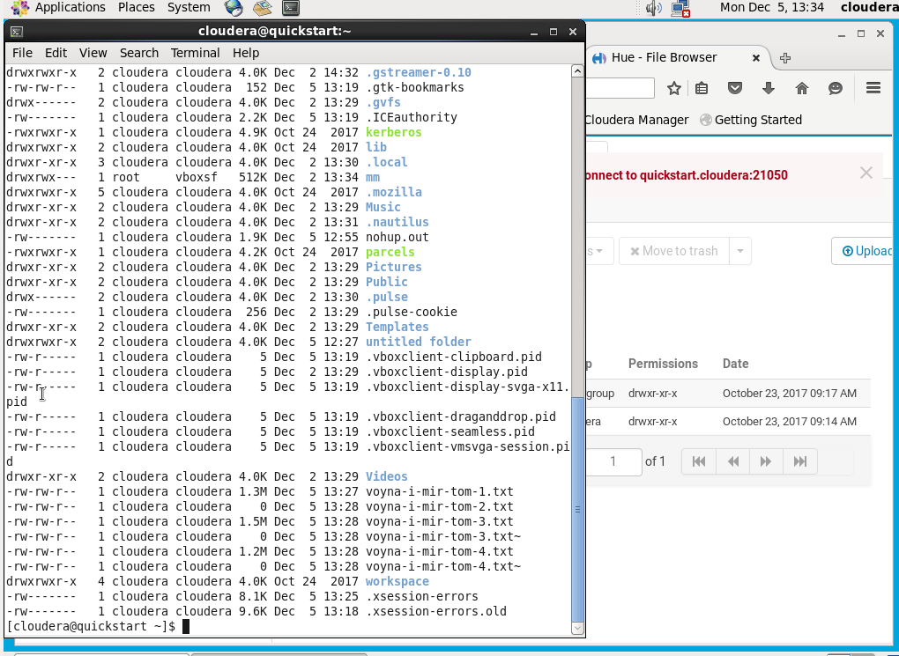
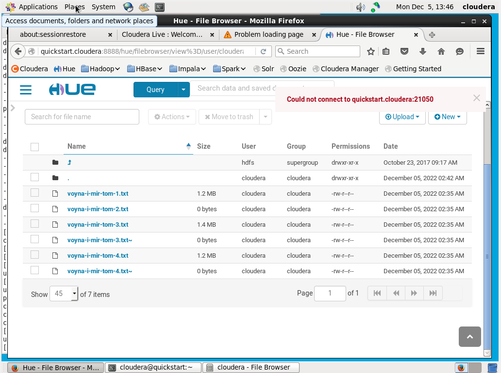
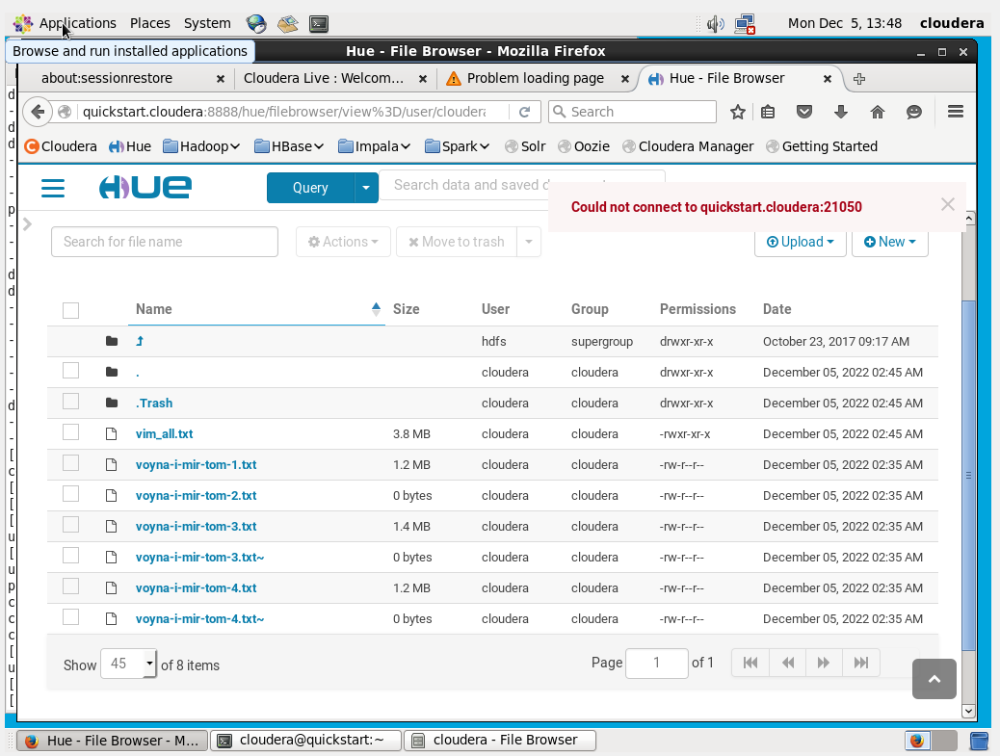
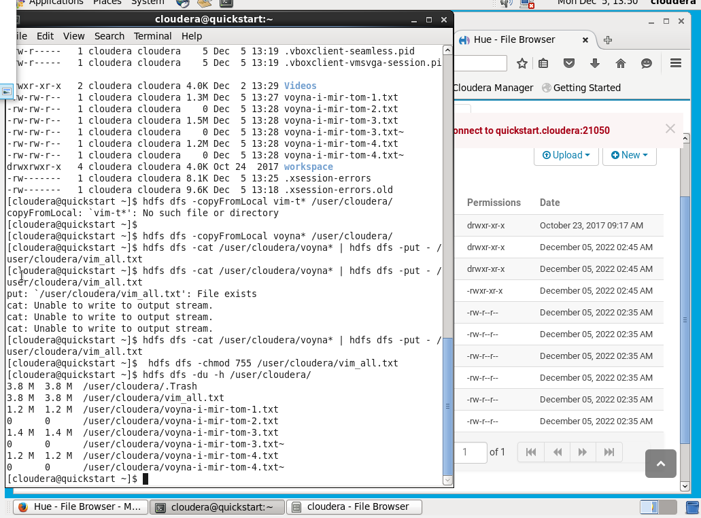
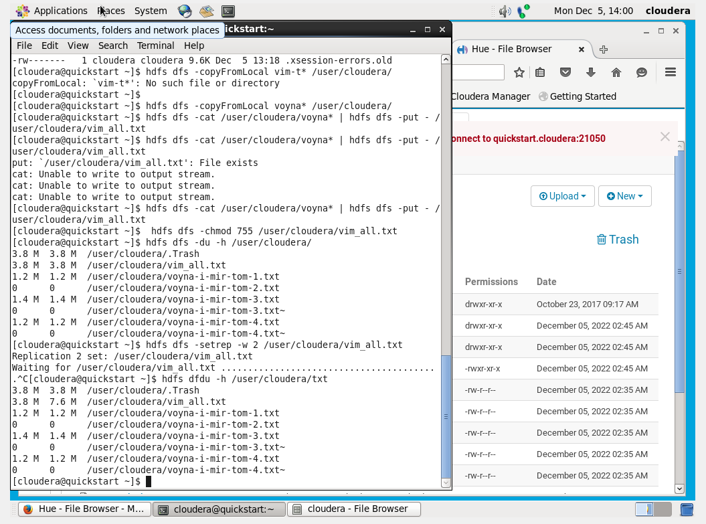

1. Установили VirtualBox и запустили ВМ Cloudera


2. Копирование файлов

3. Вывод информации о файлах в директории
```
    ls -lah
```

4. Перенос файлов на HDFS:
```
    hdfs dfs -copyFromLocal voyna* /user/cloudera/
```
![](./img/2022-12-05_13-39-26.png
5. Объединение всех томов в один файл:
```
   hdfs dfs -cat /user/cloudera/voyna* | hdfs dfs -put - /user/cloudera/vim_all.txt
```

6. Изменение прав доступа к файлу:
```
    hdfs dfs -chmod 755 /user/cloudera/vim_all.txt
```

7. Вывод информации о размере файлов:
```
    hdfs dfs -du -h /user/cloudera/
```

8. Изменение фактора репликации для файла:
```
    hdfs dfs -setrep -w 2 /user/cloudera/vim_all.txt
```
9. Вывод информации о размере файлов повторно:
```
    hdfs dfs -du -h /user/cloudera/
```

9. Подсчет количества строк в файле: 
```
    hdfs dfs -cat /user/cloudera/vim_all.txt | wc -l

    6981
```