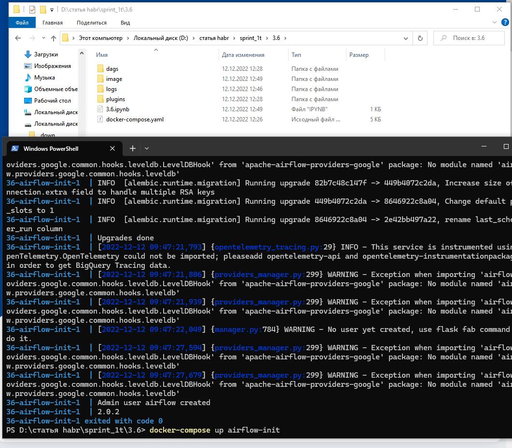
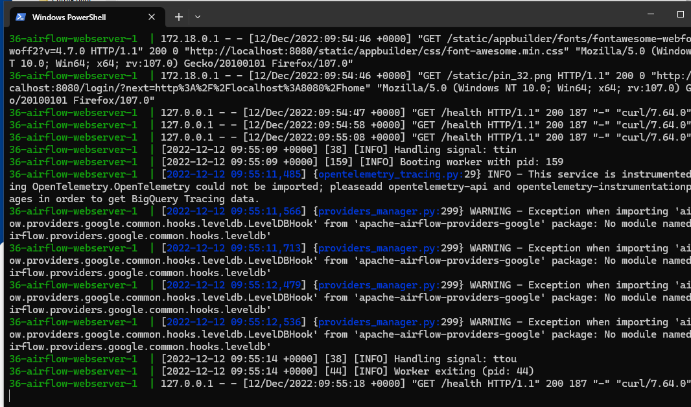
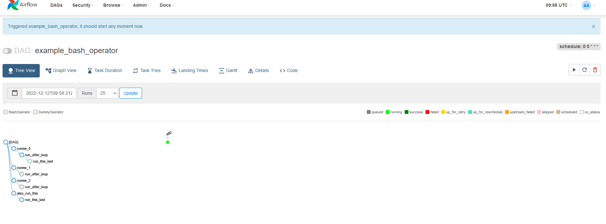
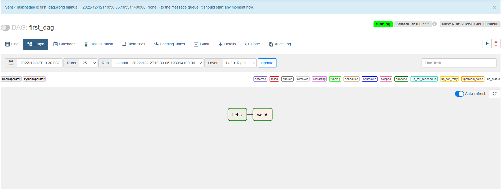
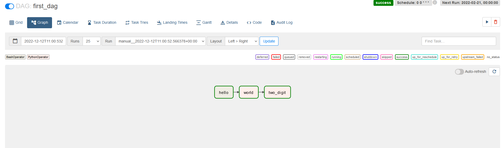
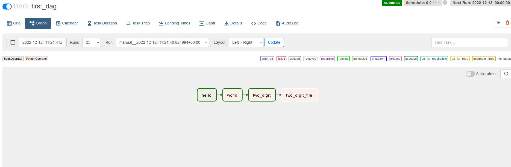

[Полный код здесь](https://github.com/ximik666/sprint_1t/blob/main/3.6/dags/first_dag.py)

### 1. Практика. Airflow. 
 - в docker разворачиваем образ, согласно инструкции [https://medium.com/@garc1a0scar/how-to-start-with-apache-airflow-in-docker-windows-902674ad1bbe](https://medium.com/@garc1a0scar/how-to-start-with-apache-airflow-in-docker-windows-902674ad1bbe)

 
 - запускаем контейнер и переходим на http://localhost:8080

 

 

 - авторизовались и запустили первый попавшийся пример
 
 

 - создание 1 dag
 ```python
from datetime import datetime
from airflow import DAG
from airflow.operators.bash import BashOperator
from airflow.operators.python_operator import PythonOperator
import random

def hello():
    print("Airflow")
def two_digit():
    with open("two_digit.txt","a") as f:
        print(random.randint(1, 100), random.randint(1, 100))


with DAG(dag_id="first_dag", start_date=datetime(2022, 1, 1), schedule="0 0 * * *") as dag:
    bash_task = BashOperator(task_id="hello", bash_command="echo hello")
    python_task = PythonOperator(task_id="world", python_callable=hello)
    python_task_2 = PythonOperator(task_id="world", python_callable=two_digit)
    bash_task >> python_task

 ```

 


 ### 2. Задания

a.  Создайте еще один PythonOperator, который генерирует два произвольных числа и печатает их. Добавьте вызов нового оператора в конец вашего pipeline с помощью

 ```python
from datetime import datetime
from airflow import DAG
from airflow.operators.bash import BashOperator
from airflow.operators.python_operator import PythonOperator
import random


def hello():
    print("Airflow")


def two_digit():
    print(random.randint(1, 100), random.randint(1, 100))


with DAG(dag_id="first_dag", start_date=datetime(2022, 1, 1), schedule="0 0 * * *") as dag:
    bash_task = BashOperator(task_id="hello", bash_command="echo hello")
    python_task = PythonOperator(task_id="world", python_callable=hello)
    python_task_2 = PythonOperator(
        task_id="two_digit", python_callable=two_digit)
    bash_task >> python_task >> python_task_2
```




### c. Если запуск произошел успешно, попробуйте изменить логику вашего Python-оператора следующим образом – сгенерированные числа должны записываться в текстовый файл – через пробел. При этом должно соблюдаться условие, что каждые новые два числа должны записываться с новой строки не затирая предыдущие. 
```python
def two_digit_file():
    with open("two_digit.txt", "a") as f:
        print(random.randint(1, 100), random.randint(1, 100), file=f)
```




 ### d. Создайте новый оператор, который подключается к файлу и вычисляет сумму всех чисел из первой колонки, затем сумму всех чисел из второй колонки и рассчитывает разность полученных сумм. Вычисленную разность необходимо записать в конец того же файла, не затирая его содержимого.
```python
from datetime import datetime
from airflow import DAG
from airflow.operators.bash import BashOperator
from airflow.operators.python_operator import PythonOperator
import random


def hello():
    print("Airflow")


def two_digit():
    print(random.randint(1, 100), random.randint(1, 100))


def two_digit_file():
    with open("two_digit.txt", "a") as f:
        print(random.randint(1, 100), random.randint(1, 100), file=f)


def summa():
    summa_1 = 0
    summa_2 = 0
    with open("two_digit.txt", "r") as f:
        for line in f.readlines():
            if len(line.strip().split()) == 2:
                summa_1 = summa_1 + int(line.strip().split()[0])
                summa_2 = summa_2 + int(line.strip().split()[1])
    raznost = summa_1 - summa_2
    with open("two_digit.txt", "a") as f:
        f.write(str(raznost) + "\n")


with DAG(dag_id="first_dag", start_date=datetime(2022, 1, 1), schedule="0 0 * * *") as dag:
    bash_task = BashOperator(task_id="hello", bash_command="echo hello")
    python_task = PythonOperator(task_id="world", python_callable=hello)
    python_task_2 = PythonOperator(
        task_id="two_digit", python_callable=two_digit)
    python_task_3 = PythonOperator(
        task_id="two_digit_file", python_callable=two_digit_file)
    python_task_4 = PythonOperator(
        task_id="two_digit_file_raznost", python_callable=summa)
    python_task_4 = PythonOperator(
        task_id="two_digit_file_raznost", python_callable=summa)
    bash_task >> python_task >> python_task_2 >> python_task_3 >> python_task_4
```


### e.Измените еще раз логику вашего оператора из пунктов 12.а – 12.с. При каждой новой записи произвольных чисел в конец файла, вычисленная сумма на шаге 12.d должна затираться.
```python
def rewrite_digit():
    with open("two_digit.txt", "r") as f:
        all_file = f.readlines()[0:-1]
    with open("two_digit.txt", "w") as f:
        f.writelines(all_file)
        f.write("\n")
        print(random.randint(1, 100), random.randint(1, 100), file=f)
```

