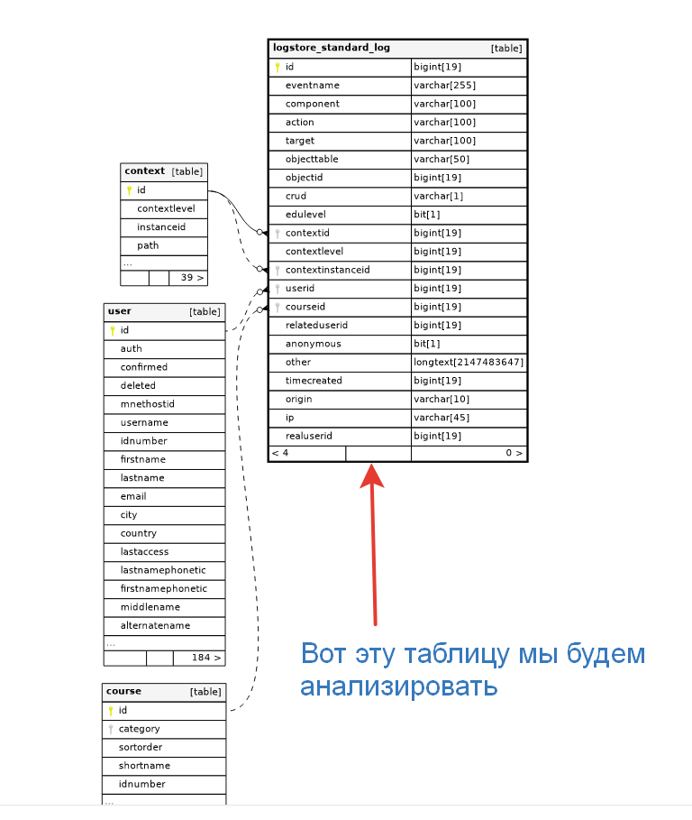

### Анализ логов активности пользователей в образовательной платформе LMS Moodle

Проект по анализу логов активности пользователей в стандартном логе logstore_standart_log в образовательной платформе LMS Moodle позволяет выявить закономерности, основные показатели посещаемости. В данном случае анализироваться будут не логи веб-сервера, а именно логи встроенные в LMS, которые дают гораздо больше полезной информации.

#### Цели проекта
- провести анализ данных посещаемости сайта
- выявить закономерности посещаемости
- провести аудит ip-адресов 
- анализ наиболее активных пользователей, преподавателей на сайте
- анализ активности курсов, наиболее посещаемые.

#### План реализации
- выявление основых метрик для отображения на dashboard
- [установка виртуального сервера](./install/VM.md)
- [установка и настройка Clickhouse](./install/Clickhouse.md)
- [установка и настройка модуля Mysql_to_Clickhouse для репликации логов с основной БД Mysql](./install/Mysql_to_click.md)
- установка и настройка Grafana
- сравнение производительности запросов в Mysql и Clickhouse
- создание и форматирование dashbord в Grafana

#### Используемые технологии
1. MySQL - это система управления базами данных.
    База данных представляет собой структурированную совокупность данных. Эти данные могут быть любыми - от простого списка предстоящих покупок до перечня экспонатов картинной галереи или огромного количества информации в корпоративной сети. Для записи, выборки и обработки данных, хранящихся в компьютерной базе данных, необходима система управления базой данных, каковой и является ПО MySQL. Поскольку компьютеры замечательно справляются с обработкой больших объемов данных, управление базами данных играет центральную роль в вычислениях. Реализовано такое управление может быть по-разному - как в виде отдельных утилит, так и в виде кода, входящего в состав других приложений. MySQL - это система управления реляционными базами данных. В реляционной базе данных данные хранятся не все скопом, а в отдельных таблицах, благодаря чему достигается выигрыш в скорости и гибкости. Таблицы связываются между собой при помощи отношений, благодаря чему обеспечивается возможность объединять при выполнении запроса данные из нескольких таблиц. SQL как часть системы MySQL можно охарактеризовать как язык структурированных запросов плюс наиболее распространенный стандартный язык, используемый для доступа к базам данных. Программное обеспечение MySQL - это ПО с открытым кодом.

    > Данная СУБД уже была установлена, соответственно никакого выбора не происходило, работаем с тем, что есть.

2. Clickhouse - столбцовая система управления базами данных (СУБД) для онлайн обработки аналитических запросов (OLAP).
Особенности
- подавляющее большинство запросов - на чтение;
- данные обновляются достаточно большими пачками (> 1000 строк), а не по одной строке, или не обновляются вообще;
- данные добавляются в БД, но не изменяются;
- при чтении, вынимается достаточно большое количество строк из БД, но только небольшое подмножество столбцов;
- таблицы являются «широкими», то есть, содержат большое количество столбцов;
- запросы идут сравнительно редко (обычно не более сотни в секунду на сервер);
- при выполнении простых запросов, допустимы задержки в районе 50 мс;
- значения в столбцах достаточно мелкие - числа и небольшие строки (пример - 60 байт на URL);
- требуется высокая пропускная способность при обработке одного запроса (до миллиардов строк в секунду на один сервер);
- транзакции отсутствуют;
- низкие требования к консистентности данных;
- в запросе одна большая таблица, все таблицы кроме одной маленькие;
- результат выполнения запроса существенно меньше исходных данных - то есть, данные фильтруются или агрегируются; результат выполнения помещается в оперативку на одном сервере.

> Данная СУБД была выбрана по причине скорости работы, оптимизации для проведения выборок, также есть плагин для репликации БД Mysql в Clickhouse без вмешательства в существующую систему. Grafana "из коробки" поддерживает СУБД Clickhouse

3. Библиотека python [https://pypi.org/project/clickhouse-mysql/](https://pypi.org/project/clickhouse-mysql/) для миграции данных из Mysql в Clickhouse.

> На данный момент Clickhouse поддерживает репликацию данных из Clickhouse напрямую, но на момент разработки проекта данной поддержки не было, поэтому пришлось пользоваться промежуточными библиотеками.

4. Grafana - это платформа с открытым исходным кодом для визуализации, мониторинга и анализа данных.  Grafana позволяет пользователям создавать дашборды с панелями, каждая из которых отображает определенные показатели в течение установленного периода времени. Каждый дашборд универсален, поэтому его можно настроить для конкретного проекта или с учетом любых потребностей разработки и/или бизнеса.

> Выбор данной платформы был связан с наличием небольшого опыта работы с ней, удобством работы и редактированием конфигурации, а также с поддержкой работы с СУБД Clickhouse напрямую

#### Схемы/архитектуры с обоснованием 