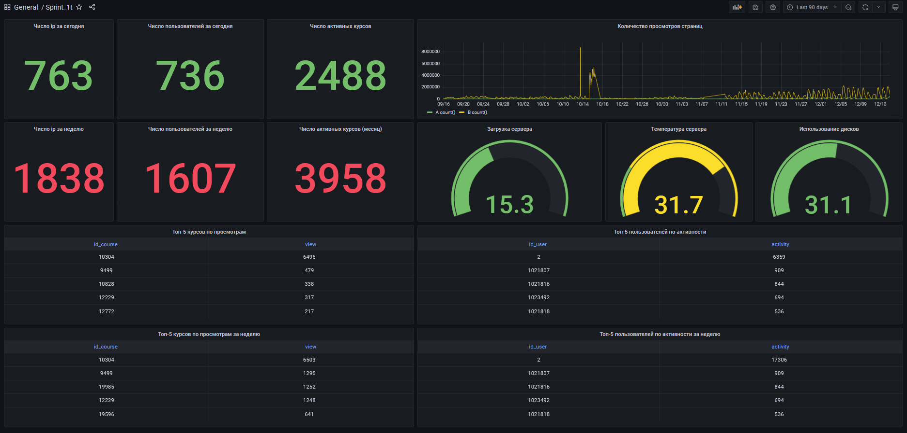

### Создание dashboard в Grafana

1. Общий вид dashboard

На dasboard отображены следующие показатели:
- посещаемость за текущий день и неделю
- активные курсы за текущий день и неделю
- количество просмотров страниц
- нагрузка, температура и занятое пространство на сервере