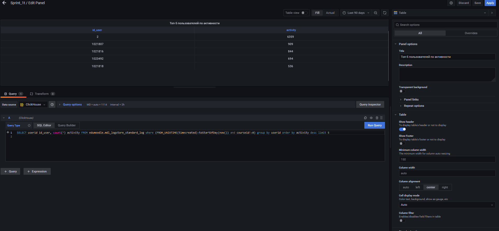
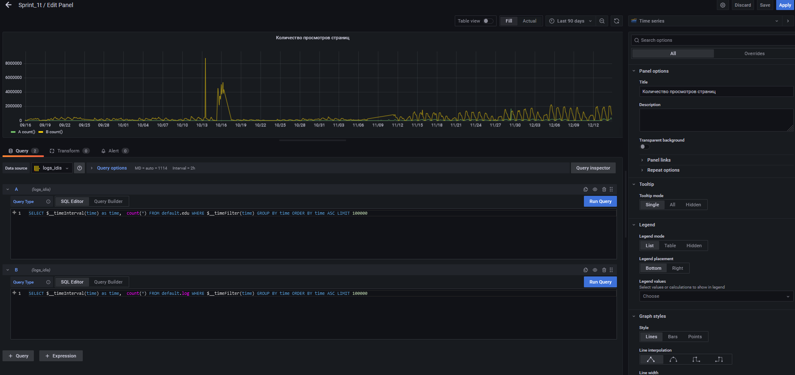

### Создание dashboard в Grafana

1. Общий вид dashboard

На dasboard отображены следующие показатели:
- посещаемость за текущий день и неделю
- активные пользователи за текущий день и неделю
- активные курсы за текущий день и неделю
- количество просмотров страниц
- нагрузка, температура и занятое пространство на сервере

Также на этом графике мы видим DDOS атаку, проведенную на сервер. На данный момент добавлен alert на такие вещи.

2. Примеры редактирование dashboard

3. Если мы посмотрим недельные график посещаемости, то явно можно увидеть закономерность посещаемости.

