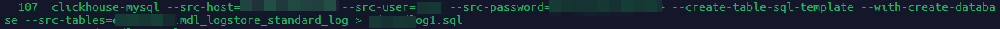
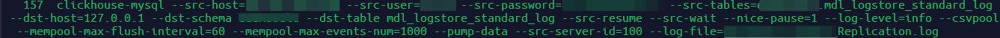

### Установка и настройка модуля Mysql_to_Clickhouse для репликации логов с основной БД Mysql
Изначально Clickhouse не поддерживал автоматическую репликацию с СУБД Mysql, пришлось использовать стороннюю [библиотеку](https://pypi.org/project/clickhouse-mysql/) на Python.
Установили согласно [инструкции](https://github.com/Altinity/clickhouse-mysql-data-reader/blob/master/docs/manual.md).

1. Делаем дамп столбцов необходимой таблицы



2. Восстанавливаем дамп в базу Clickhouse


3. Запускаем и долго ждем первую синхронизацию



4. Попробуем выполнить первый запрос и посмотреть количество строк в таблице с логами

```
select count(*) from XXXX.mdl_logstore_standard_log;

SELECT count(*)
FROM XXXX.mdl_logstore_standard_log

Query id: 33d117b4-bd2e-4708-a365-8619f8280603

┌──count()─┐
│ 58267361 │
└──────────┘

1 row in set. Elapsed: 0.139 sec.
```

> 58 млн.записей - думаю достаточно для проведения какого-нибудь анализа.